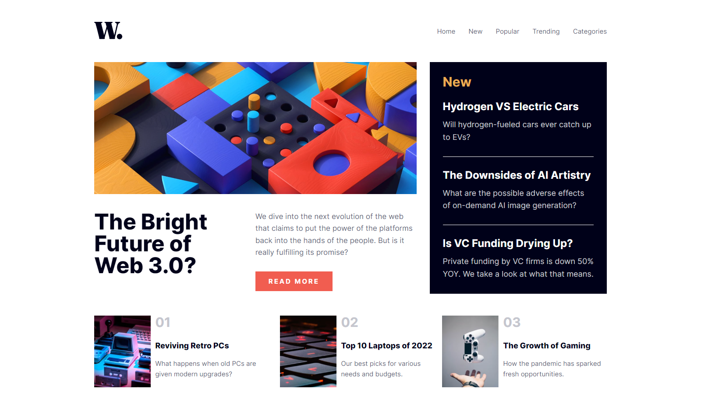

# Frontend Mentor - News homepage solution

This is a solution to the [News homepage challenge on Frontend Mentor](https://www.frontendmentor.io/challenges/news-homepage-H6SWTa1MFl). Frontend Mentor challenges help you improve your coding skills by building realistic projects. 


### The challenge

Users should be able to:

- View the optimal layout for the interface depending on their device's screen size
- See hover and focus states for all interactive elements on the page

### Screenshot



### Links

- Solution URL: https://github.com/ahmedZ0k/News-homepage
- Live Site URL: https://ahmedz0k.github.io/News-homepage/#

## My process

### Built with

- Semantic HTML5 markup
- CSS custom properties
- Flexbox
- CSS Grid
- JavaScript


### What I learned
First Time use JavaScript it's a small work but it's the start

```js
function openTheMenu() {
  links.style.display = "flex";
}
```


### Continued development

I will continue learning JavaScript

### Useful resources


## Author

- Linkedin - [Add your name here](https://www.linkedin.com/in/ahmed-zakaria-63b72b1b5/)
- Frontend Mentor - [@yourusername](https://www.frontendmentor.io/profile/ahmedZ0k)
- Github - [@yourusername](https://github.com/ahmedZ0k)

